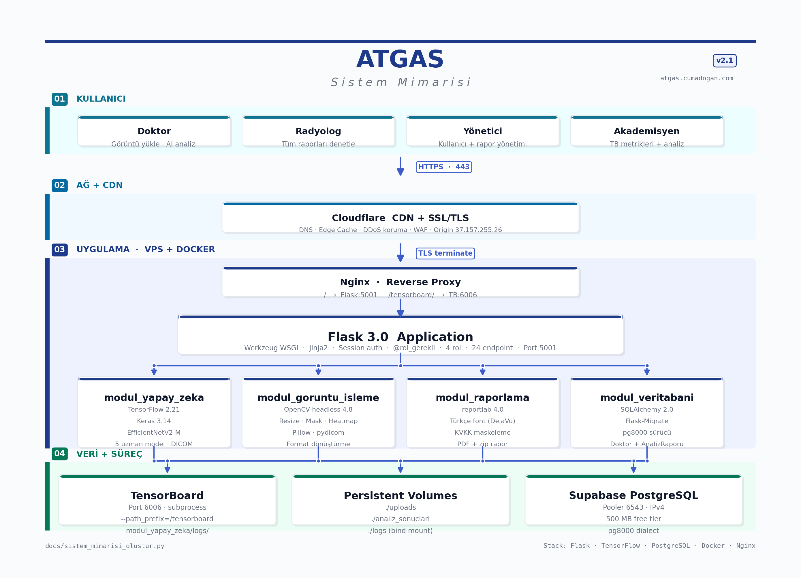

# 🩺 Akıllı Tıbbi Görüntü Analiz Sistemi (ATGAS)

Yapay zeka destekli tıbbi görüntü analiz platformu. X-ray, MRI ve CT taramalarını analiz ederek potansiyel hastalıkları otomatik olarak tespit eder ve doktorlara hızlı, doğru teşhis koyma imkanı sunar.

## 🚀 Projenin Tüm Aşamaları

Proje, Agile/Scrum prensiplerine göre haftalık (Sprint) döngüler şeklinde planlanmış ve yürütülmüştür:

*   **Hafta 1 (Proje Hazırlığı ve Planlama):** Proje kapsamı, gereksinim analizi ve hedefler belirlendi. Veri setleri incelenip ilk ön işleme kararları alındı, teknoloji yığını seçimi (TensorFlow, OpenCV, Flask vs.) yapılarak geliştirme ortamları kuruldu.
*   **Hafta 2 (Temel Tasarım ve Araştırma):** Hastalık tespit algoritmaları araştırıldı. Görüntü ön işleme teknik analizleri çıkarılırken veritabanı entegrasyon planı, kullanıcı arayüzü (UI) ve raporlama gereksinimleri için prototip tasarımları planlandı.
*   **Hafta 3 (Mimari Tasarım ve Şablonlar):** Veritabanı şeması, raporlama sistemi ve görüntü ön işleme modül tasarımları oluşturuldu. Web arayüzü temel şablonları, hastalık tespit algoritma entegrasyonuna hazır hale getirildi. 
*   **Hafta 4 (Çekirdek Geliştirme ve Testler):** Akciğer Nodülü tespiti bağlamında temel hastalık algoritması geliştirildi ve DICOM okuma/ön işleme entegrasyonları hazırlandı. Bu aşamada ön işleme modülü birim (unit) testlerden geçirildi. Arayüz görüntü yükleme fonksiyonelliği kodlandı.
*   **Hafta 5 (Optimizasyon ve Ara Değerlendirme):** Modeller eğitildi, performans metrikleri (kesinlik, vb.) değerlendirilip optimize edildi. Veri seti ön işleme adımları ve loglamaları tamamlanarak kullanıcı arayüzüne entegrasyon başlatıldı. Ara raporlar sunuldu.
*   **Hafta 6 (Final Entegrasyon, Test ve Kapanış):** Site içi kullanıcı rolleri eklendi, arayüz UX iyileştirmeleri tamamlandı. Modellerin tam teşekküllü test edilmesi ve entegrasyonu sağlandıktan sonra, API dokümantasyonu ve sistem bitiş belgeleri yazılarak final sunumu provaları gerçekleştirildi.

---

## 🏛 Sistem Mimarisi

Uygulamanın mimari yapısı yüksek erişilebilirlik ve güvenlik üzerine kurulmuştur. İstek ve veri akışı aşağıdaki katmanlardan oluşmaktadır:
**Cloudflare → Nginx → Docker → Flask → Supabase**

---

## 🔐 Kullanıcı Rolleri ve Yetkilendirme

Sistem içerisinde güvenliği ve özel verilerin korunmasını sağlamak amacıyla dört temel kullanıcı rolü tanımlanmıştır. API ve arayüz üzerindeki yetki kısıtlamaları alt yapıda tasarlanan `@rol_gerekli` dekoratörü ile güvence altına alınmıştır:
*   **Admin:** Tüm sistemin, kullanıcı tanımlamalarının (doktor, radyolog vb.) yönetimi ve ayarlarından sorumludur.
*   **Doktor:** Analiz sonuçlarını inceler, tıbbi verileri değerlendirir ve asıl teşhis/raporlama süreçlerini onaylar.
*   **Radyolog:** Hastaların tarama görüntülerini (DICOM, JPG, PNG) sisteme yükler ve ilk yapay zeka analiz zincirini başlatabilir.
*   **Akademisyen:** Geliştirilen AI modelinin istatistiksel metriklerini (başarı oranı vb.) kişisel veriye erişmeden sadece izleme düzeyinde görüntüleyebilir.

---

## 🛠 Teknoloji Yığını ve Deployment (Production)

Projenin modüler çalışma ve production ortamındaki teknoloji stack dağılımı:
*   **Yapay Zeka & Görüntü İşleme:** TensorFlow, Keras, TensorBoard, OpenCV, pydicom
*   **Backend & Veritabanı:** Python, Flask, Supabase (PostgreSQL), SQLAlchemy, pg8000
*   **Production Server Altyapısı:** Docker, Nginx, Cloudflare, Git LFS
*   **Raporlama Modülü:** reportlab
*   **Desteklenen Tıbbi Formatlar:** DICOM (`.dcm`), JPG, PNG

---

## 🛠 Kullanılan Algoritmalar

- **Görüntü İşleme ve Ön İşleme Algoritmaları:** 
  - Boyutlandırma ve İnterpolasyon
  - CLAHE (Contrast Limited Adaptive Histogram Equalization) - Kontrast Artırıcı Algoritma
  - Min-Max Normalization
- **Yapay Zeka & Derin Öğrenme Algoritmaları:**
  - **Evrişimli Sinir Ağları (CNN)**
  - Derin Öğrenme Mimari Modeli: **EfficientNetV2-M**

---

## 📂 Veri Seti (Dataset)

Veri setimizde sınıfların dengesiz durumu çözmek için sentetik verilerle (Data Augmentation) örnekler çoğaltılmıştır. Veriler genel olarak CT, MRI ve X-Ray taramalarından oluşmaktadır:

*   **CT (Bilgisayarlı Tomografi):** 
    *   *Akciğer Nodülü:* Hastalıklı, Normal
    *   *Beyin Kanaması:* EDH, IPH, IVH, SAH, SDH, Normal
*   **MRI (Manyetik Rezonans):**
    *   *Lomber Disk Hernisi (Bel Fıtığı):* Hastalıklı, Normal
    *   *Meningioma (Beyin Tümörü):* Hastalıklı, Normal
*   **X-Ray (Röntgen):**
    *   *Akciğer Tarama Sınıfları:* Covid-19, Normal, Tüberküloz, Zatürre

---

## 🏗 Model Mimarisi

*   **Model Türü:** EfficientNetV2-M (TensorFlow / Keras üzerinden)
*   **Giriş (Input) Katmanı:** (384, 384, 3) boyutunda, 0-1 arasına Normalize edilmiş RGB Görüntü Matrisi.
*   **Çıkış (Output) Katmanı:** Farklı beyin ve akciğer hastalığı sınıfları için sınıf sayısına uygun output (Softmax veya Sigmoid aktivasoynu).
*   **Optimizasyon:** TF XLA ayarlamalarıyla bellek performansı iyileştirildi. Sınıfların olasılık değerleri alınarak front-end'e aktarıldı.

---

## 🎯 Sonuçlar ve Metrikler

*   **Modül Testi:** Geliştirilen ön işleme (ImagePreprocessor) Unit testlerinden **%100 Başarı** ile geçmiştir.
*   **Hız:** Seçilen mimariler (EfficientNetV2-M, OpenCV CLAHE) ile görüntü analizi süresi **< 5 Saniye** kriterine ulaşmıştır.
*   **Doğruluk:** Modeller dengelenmiş veri seti sayesinde belirlenen hedeflerin (%90 Accuracy / %85 F1-Score) karşılanmasında gerekli altyapıyı sağlamıştır.

---

## 🌐 API Dokümantasyonu

Web arayüzünde ve dış entegrasyonlarda kullanılmak üzere tasarlanan uç noktalar:

### POST /api/analiz
*   **İşlev:** Yüklenen görüntünün analiz sürecini başlatır ve yapay zeka modelini çalıştırır.
*   **İstek Yapısı (FormData):** 
    *   `goruntu`: Tıbbi görüntü dosyası (DCM, JPG, PNG)
    *   `uzman_kodu`: Gerekli analiz türevi (örn: `xray`, `ct_beyin`)
    *   `hasta_ad_soyad`: Hasta Adı Soyadı
    *   `hasta_tc`: Hasta TC Kimlik No
    *   `hasta_dogum_tarihi`: Hasta Doğum Tarihi
    *   `protokol_no`: Hastane Protokol Numarası
*   **Dönüş Değeri:** Tahmin edilen hastalık, güven yüzdesi listesi ve tespit görsel yolunu (URL) içeren JSON veri kümesi.

### POST /api/save_draft
*   **İşlev:** Doktor panelinden süren teşhis sürecini "Taslak" (Draft) olarak geçici kaydeder.
*   **İstek Yapısı:** Analiz sonuçlarını ve hasta bilgilerini barındıran JSON bloğu.

### POST /api/save_report
*   **İşlev:** Onaylanan analizi kalıcı veritabanına rapor olarak kaydeder.
*   **Dönüş Değeri:** Başarı durumu ve ilişkili `rapor_id` değerini içeren JSON objesi.

### POST /api/iptal (veya GET)
*   **İşlev:** Arka planda fazla uzun süren veya gereksiz analiz sürecini durdurmak için asenkron istektir.

### DELETE /api/raporlar/<int:rapor_id>
*   **İşlev:** Belirtilen kimliğe (`rapor_id`) sahip raporu sistemden veritabanı uçlarında kalıcı olarak siler.

### GET /raporlar/<int:rapor_id>/pdf
*   **İşlev:** İlgili raporun özetini, hasta formlarını ve yapay zekanın işaretlendiği görseli içeren hazır **PDF dokümanı** döndürür (File Download).

---

## 👥 Geliştirici Ekip
Bu proje, Agile/Scrum metodolojisi takip edilerek aşağıdaki ekip tarafından geliştirilmektedir:
* 👑 **Cuma Doğan** - Yazılım Mühendisi (Scrum Master)
* 💻 **Nihal Eylül İl** - Yazılım Mühendisi
* 💻 **Ozan Diyar Ay** - Yazılım Mühendisi
* 💻 **Esmanur Ulu** - Yazılım Mühendisi
* 💻 **Elif İkra Çakmak** - Yazılım Mühendisi
